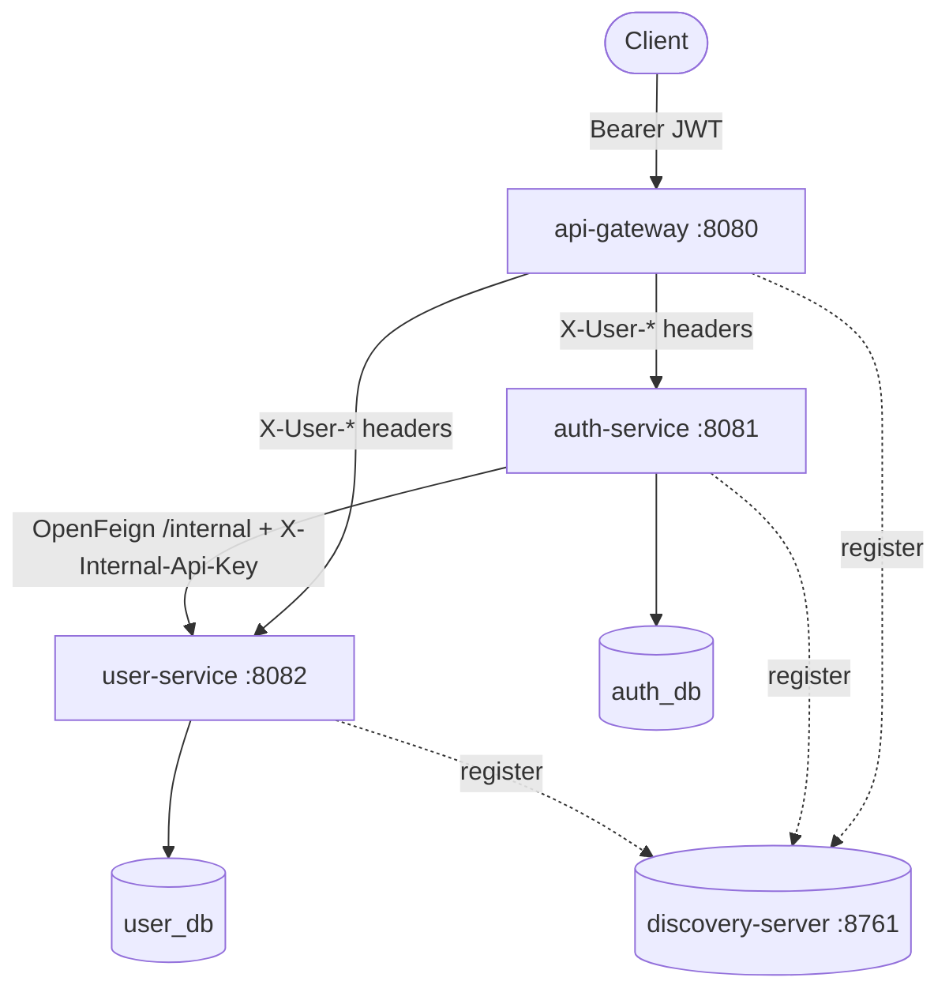
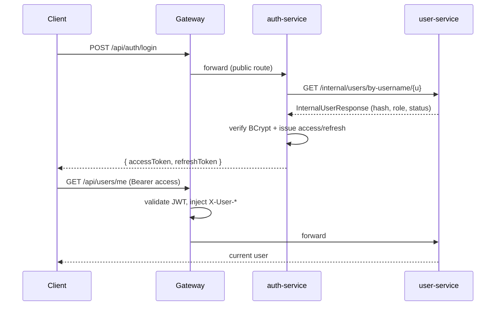

# Diagrams

Source-controlled diagrams (Mermaid / draw.io exports) live here.

## Component diagram (Mermaid)

```mermaid
flowchart TB
    client([Client])
    gw[api-gateway :8080]
    auth[auth-service :8081]
    user[user-service :8082]
    eureka[(discovery-server :8761)]
    authdb[(auth_db)]
    userdb[(user_db)]

    client -->|Bearer JWT| gw
    gw -->|X-User-* headers| auth
    gw -->|X-User-* headers| user
    auth -->|OpenFeign /internal + X-Internal-Api-Key| user
    auth --> authdb
    user --> userdb
    gw -. register .-> eureka
    auth -. register .-> eureka
    user -. register .-> eureka
```

## Auth sequence (Mermaid)

```mermaid
sequenceDiagram
    participant C as Client
    participant G as Gateway
    participant A as auth-service
    participant U as user-service
    C->>G: POST /api/auth/login
    G->>A: forward (public route)
    A->>U: GET /internal/users/by-username/{u}
    U-->>A: InternalUserResponse (hash, role, status)
    A->>A: verify BCrypt + issue access/refresh
    A-->>C: { accessToken, refreshToken }
    C->>G: GET /api/users/me (Bearer access)
    G->>G: validate JWT, inject X-User-*
    G->>U: forward
    U-->>C: current user
```
